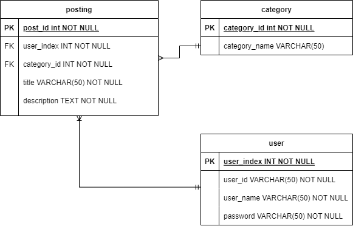

# **cafe-API**
 온라인 카페에서 유저, 게시글을 CRUD 하는 시스템 구현하는 미니 프로젝트

[프로젝트 리포지토리](https://github.com/soulchicken/cafe-API)

## **00. 팀원 명단**

-   **[황솔희](https://github.com/solhee-hwang)** 
-   **[강  건](https://github.com/gun-0208)** 
-   **[김도현](https://github.com/thovy)** 
-   **[김동현](https://github.com/soulchicken)** 

## **01. 기술 스택**

-   JAVA 1.8
-   **Spring** 5.3.14
-   **MySQL** 8.0.28
-   hibernate 5.4.10.Final
-   jackson.core 2.12.3
-   JDBC
-   Maven

## **02. 프로젝트 주제**

### **cafe-API**
- CRUD를 다 구현보자는 목표를 가지고 시작한 카페 구현
- 회원 , 게시글 관리 및 카테고리 설정도 가능한 카페

## **03. 도메인 관련 용어**

- **👨 회원(user)** : 회원가입 진행 시 카페에 글을 게시 및 수정을 할 수 있다.
- **🔖 범주(category)**
    1. 사물의 개념을 분류함에 있어서 그 이상 일반화할 수 없는 가장 보편적이고 기본적인 유개념이다.
    2. 게시글 작성 시 본인만의 분류를 만들기 위해 사용한다.
- **🚀 게시글(posting)**
    1. 러 사람이 볼 수 있도록 인터넷 게시판에 올린 글

## **04. 기능 명세**
[API DOCS](https://documenter.getpostman.com/view/21185842/Uz5CNdz2)

### 회원관련 기능
- 아이디,비밀번호,이름을 입력하면 회원테이블에 정보가 저장된다.
- 찾고자 하는 회원 인덱스를 입력하면 회원정보와 회원이 작성한 게시글 제목들이 조회된다.
- 수정하고자 하는 회원 인덱스와 바꿀 비민번호를 입력하면 해당 회원의 비민번호가 변경된다.
- 삭제하고자 하는 회원 안덱스를 입력하면 해당 회원정보는 삭제된다.

### 카테고리관련 기능
- 원하는 카테고리 이름을 입력하면 카테고리 테이블에 정보가 저장된다. 
- 찾고자 하는 카테고리 인덱스를 입력하면 카테고리정보와 해당 카테고리에 작성된 게시글 제목들이 조회된다
- 수정하고자 하는 카테고리 인덱스와 카테고리 이름을 입력하면 해당 카테고리가 변경된다.
- 삭제하고자 하는 카테고리 인덱스를 입력하면 해당 카테고리는 삭제된다.

### 게시글 관련기능
- 회원 인덱스, 본론, 제목, 카테고리를 입력하면 게시글테이블에 정보가 저장된다. 
- 찾고자 하는 게시글 인덱스를 입력하면 작성한 유저이름, 작성된 카테고리 및 게시글 정보들이 조회된다.
- 수정하고자 하는 게시글 인덱스와 본론, 카테고리, 제목, 유저아이디를 입력하면 해당 게시글이 변경된다.
- 삭제하고자 하는 게시글 인덱스를 입력하면 해당 게시글은 삭제된다.

## **05. ERD (Entity Relationship Diagram)**
- ERD 그림 캡처본

### **user** 테이블
| column          | data type | 설명      |
|-----------------| --- |---------|
| user_index (PK) | BIGINT | 고유 인덱스  |
| user_id         | VARCHAR(45) | 회원 아이디  |
| user_name       | VARCHAR(45) | 회원 이름   |
| password        | VARCHAR(45) | 회원 비밀번호 |

- 회원 정보가 저장된다
- 처음 가입 시 회원 게시글 목록은 비어있다.
### **category** 테이블
| column          | data type | 설명      |
|-----------------| --- |---------|
| category_id(PK) | BIGINT | 고유 인덱스  |
| category_name   | VARCHAR(45) | 카테고리 이름 |

- 카테고리 정보가 저장된다
- 처음 생성 시 카테고리에 입력된 게시글 목록은 비어있다
### **posting** 테이블
| column           | data type    | 설명       |
|------------------|--------------|----------|
| post_id (PK)     | BIGINT       | 고유 인덱스   |
| category_id (FK) | BIGINT       | 카테고리 아이디 |
| user_id (FK)     | BIGINT       | 회원 아이디   |
| description      | VARCHAR(255) | 본문       |
| title            | VARCHAR(255) | 제목       |
- 게시글 정보가 저장된다.
## **06. 트러블 슈팅**
- 환경 설정 
  1. 김동현님의 repository에서 clone을 하려했지만 팀원들 마다 이클립스 버전이 다른 등의 이유로 각자 환경에서 개발하기로 함
  2. 강건님은 mariadb를 사용하셨고 다른 팀원은 mysql을 사용하면서 pk 값으로 String을 받는 작업이 건님만 되버리는 이슈 발생. 따라서 pk 값을 int타입으로 변경
- 무한루프 : 테이블들을 서로 참조키로 받아 작성하였는데  Entitiy를 return했을 때 객체 안에 다른 Entity가 들어있고 그 Entity에서 return 할 Entity가 
들어있는 과정이 반복되면서 무한루프에 빠지게 됨. 
따라서 해당 결과값을 받기 위해서는 Entity를 return하는 것이 아닌 toString 을 return 받아 화면에 띄우는 형식으로 변경
- find 문제 : find를 인덱스 값이 아닌 이름으로 찾고자 했지만 Mysql이 pk 값을 string으로 받기 위해서는 별개의 설정을 만져주거나 jpql을 사용해야하는데
사용하지 못하고 int타입을 pk로 설정
- delete 문제 : 카테고리가 삭제될 떄 참조 받은 posting테이블의 카테고리를 삭제해야하는데 해당 부분 구현 실패 

## **07. 느낀 점**

- 황솔희 : 환경설정을 하느라 시간을 너무 많이 쓴것,,, 이클립스는 일단 최악이라는걸 또 느끼는 순간,, 
무한 루프를 못찾아서 힘들었다,, 에러 찾기 너무 힘들어요..😭
- 강  건 : 건님은 .. 시술받으러 떠나셨따... 쾌차하세요..!

- 김도현 : 팀원들과 같은 환경으로 맞추는 게 매우 힘들었습니다. 테이블 간의 연결은 참 어렵습니다. 복습하며 많이 배우겠습니다.

- 김동현 : 스프링 백엔드 개발자는 돈을 많이 받아받아야겠어요... 협업이고 뭐고 구현도 힘들고 환경도 애먹고 그렇네요.
